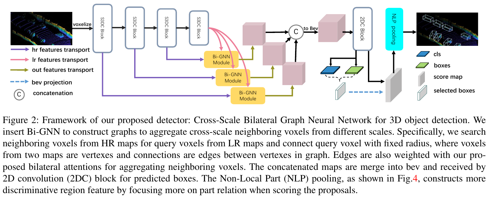
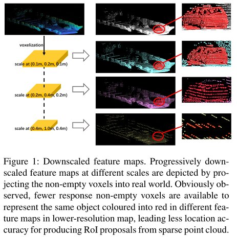

# CBi-GNN

CBi-GNN: Cross-Scale Bilateral Graph Neural Network for 3D object detection

  

## Motivation

  

## Requirements

1. [spconv](https://github.com/traveller59/spconv)
2. python >= 3.7
3. pytorch >= 1.1

## Installation

1. Follow the instruction in [spconv](https://github.com/traveller59/spconv)
2. `pip install -r requirements.txt`
3. build iou3d `cd dets/ops/iou3d && sh install.sh`
4. build pointnet2 `cd dets/ops/pointnet2 && sh install.sh`
5. build points_op `cd dets/ops/points_op && sh install.sh`

## Usage

### Inference

#### Test on validation

- `cd excutes && python test.py ../configs/default.py ../experiments/checkpoint.pth --save_to_file True --gpus=1`

#### Kitti server

- `cd excutes && python test.py ../configs/default.py ../experiments/checkpoint.pth --save_to_file True --gpus=1 --test`

### Train

- `cd excutes && python train.py ../configs/default.py --gpus=1`

## Benchmark

|  Metrics |  Easy | Moderate |  Hard |
|:--------:|:-----:|:--------:|:-----:|
| recall@11 | 90.26 |   79.83  | 78.45 |
| recall@40 | 93.36 |   84.35  | 81.15 |+

## Models

- [X] CBi-GNN
- [X] SECOND
- [ ] PointPillar
- [ ] PartA^2
- [ ] PV-RCNN

## Datasets

- [X] Kitti
- [ ] Waymo
- [ ] NuScenes

## Based Framework

- [X] MMCV
- [X] PytorchLightning
