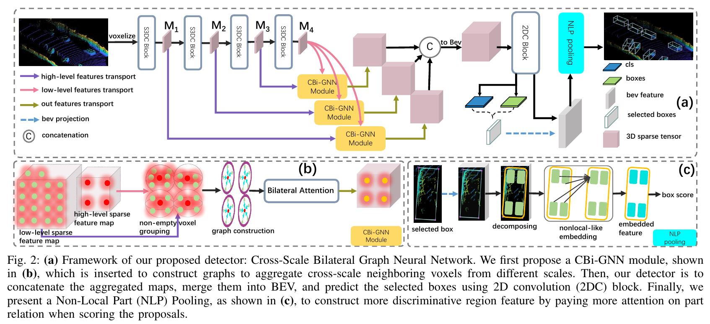
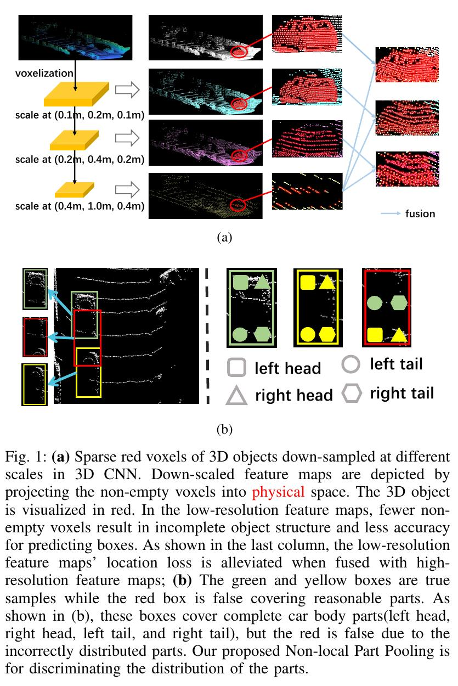

# CBi-GNN

CBi-GNN: Cross-Scale Bilateral Graph Neural Network for 3D object detection
<div align=center>
  
</div>

## Motivation

<div align=center>
  
</div>

## Requirements

1. [spconv](https://github.com/traveller59/spconv)
2. python >= 3.7
3. pytorch >= 1.1

## Installation

1. Follow the instruction in [spconv](https://github.com/traveller59/spconv)
2. build iou3d `cd dets/ops/iou3d && sh install.sh`
3. build pointnet2 `cd dets/ops/pointnet2 && sh install.sh`
4. build points_op `cd dets/ops/points_op && sh install.sh`


## Dataset 
  Dataset is downloaded from [KITTI](http://www.cvlibs.net/datasets/kitti/eval_object.php?obj_benchmark=3d) and orgnized as follow:
  
  ```
  ├── data
  │   ├── KITTI
  │   │   ├── ImageSets
  │   │   ├── object
  │   │   │   ├──training
  │   │   │      ├──calib & velodyne & label_2 & image_2 & (optional: planes)
  │   │   │   ├──testing
  │   │   │      ├──calib & velodyne & image_2
  ├── lib
  ├── pointnet2_lib
  ├── tools
  ```
## Usage

#### Model
- Model trained has been released on [Google Drive](https://drive.google.com/file/d/13V71iLbhWDYssMmRSzmwo57Vzm8XCD5P/view?usp=sharing) and we will release more of different settings soon.
#### Test on validation

- `cd excutes && python test.py ../configs/cbignn.py checkpoint_epoch_50.pth --save_to_file True --gpus=1`

#### Kitti server

- `cd excutes && python test.py ../configs/cbignn.py ../experiments/reproduce/cbignn/checkpoint.pth --save_to_file True --gpus=1 --test`

### Train

- `cd excutes && python train.py ../configs/cbignn.py --gpus=1`

## Benchmark

|  Metrics |  Easy | Moderate |  Hard |
|:--------:|:-----:|:--------:|:-----:|
| recall@11 | 90.26 |   79.83  | 78.45 |
| recall@40 | 93.36 |   84.35  | 81.15 |+

## Models

- [X] CBi-GNN
- [X] SECOND
- [ ] PointPillar
- [ ] PartA^2
- [ ] PV-RCNN

## Datasets

- [X] Kitti
- [ ] Waymo
- [ ] NuScenes

## Based Framework

- [X] MMCV
- [X] PytorchLightning
